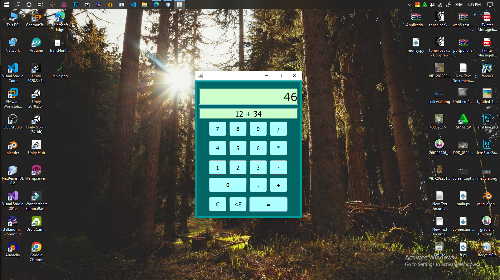
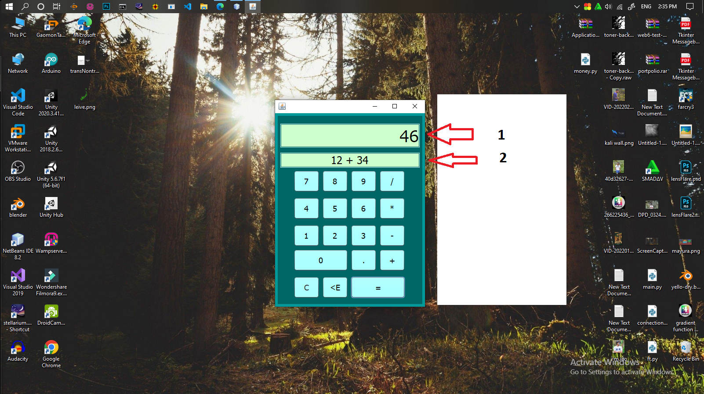
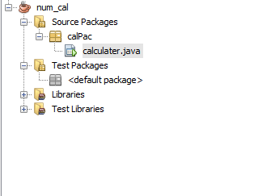

# Java-Calculater
simple java calculater

<h2>This Is A Simple Calculater</h2>
Developed in the Java programming language through NetBeans.

<h2>Instructions for use</h2>

<li>First download the project</li>
<li>After that, open this project through NetMeans</li>
<li>Open calculator.java in calPac in Source Packages in num_cal</li>
<li>After that, you can open it with F6 if you don't want to run</li>

 

 
 

<h2>Parts Of calculater</h2> 

<li>(1) Main Display</li>
<li>(2) Program Moniter</li>
<li>(C button) Clear All Calculations and Displays</li>
<li>(<E button) Backspace numbers</li>
  
<h2>Path Of Project File</h2>

